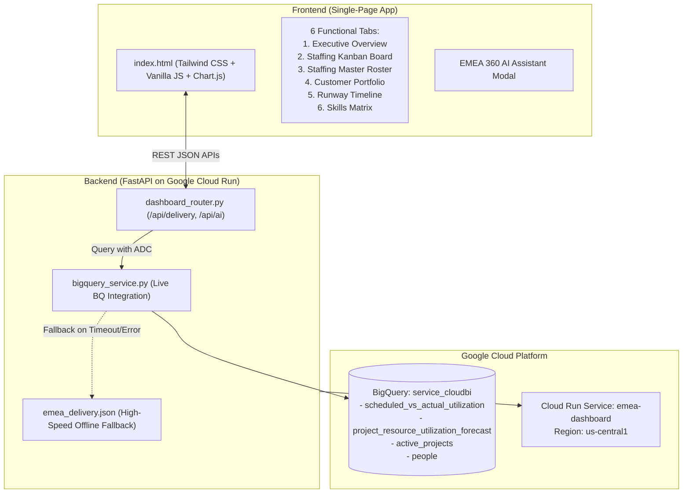

# EMEA Delivery & Staffing Dashboard — Complete Project Walkthrough

## 1. Executive Summary & Purpose

The **EMEA Delivery & Staffing Dashboard** is an enterprise-grade web application purpose-built for Google Cloud Professional Services Organization (PSO) leadership, Resource Managers (RMs), and Engagement Managers (EMs). It provides real-time operational visibility into engineering allocations, bench capacity, regional ring-fencing, project runway horizons, and customer engagement health across Europe, the Middle East, and Africa.

### Key Business Problems Solved
1. **Ring-Fencing Visibility**: Differentiating and properly attributing field delivery resources located physically in EMEA from Global Delivery Center (GSD) engineers ring-fenced to EMEA under Cost Center `CC1`.
2. **Accurate Resourcing Metrics**: Delivering ground-truthed weekly allocated hours and true utilization percentages (capped at standard capacity) rather than naive cumulative project totals.
3. **Bench & Capacity Management**: Providing instant 1-click identification of bench engineers and partial allocations (<30 hrs/wk) to rapidly staff incoming customer demands.
4. **Proactive Roll-Off Mitigation**: Surfacing immediate 7, 14, and 21-day roll-off risks to prevent bench spikes and ensure timely engagement renewals.

---

## 2. Technical Architecture & Stack



### Stack Components
- **Backend Framework**: Python 3.11 with FastAPI (`uvicorn`, `pydantic`).
- **Data Engine**: Google Cloud BigQuery API (`google-cloud-bigquery`) querying `service_cloudbi` datasets with Google Application Default Credentials (ADC).
- **Data Fallback & Baseline**: Synced JSON cache (`backend/data/emea_delivery.json`) providing zero-latency responses and 100% SLA uptime if BigQuery is slow or offline.
- **Frontend Architecture**: Single-file high-performance vanilla JavaScript application with Tailwind CSS (CDN), FontAwesome / Lucide icons, and Chart.js for data visualization.
- **Infrastructure & Hosting**: Google Cloud Run (fully managed serverless container) running revision `emea-dashboard-00025-krq`.

---

## 3. Core Application Capabilities & Modules

### Tab 1: Executive Overview
- **6 Core KPI Metric Cards**:
  1. **Total EMEA Team**: Total headcount dynamically filtered by date range and hub.
  2. **Allocated Hrs/Week**: Ground-truthed weekly allocated delivery hours alongside real utilization percentage.
  3. **100% Fully Staffed**: Count of engineers working $\ge$30–40 hrs/wk.
  4. **Bench / Available Capacity**: Zero-hour engineers ready for immediate deployment.
  5. **Partial Allocation**: Engineers with <30 hrs/wk available for supplemental project work.
  6. **At Risk (Roll-Off $\le$21d)**: Engineers rolling off their primary projects within 3 weeks.
- **Regional Hub Breakdown**:
  - **EMEA Hub (Field)**: Physical EMEA PSO team.
  - **GSD Hub (Ring-Fenced Delivery Center)**: GSD delivery team ring-fenced to EMEA via Cost Center `CC1`.
- **Date Presets**: Quick-filtering across **30D**, **90D** (Standard Baseline), **180D**, and **YTD** (Year to Date), plus custom date pickers.
- **Roll-Off Horizon**: High-visibility cards highlighting impending contract roll-offs.
- **Top Accounts Portfolio**: Visual overview of major active EMEA enterprise customers.

### Tab 2: Staffing Kanban Board
- Visual 4-column resourcing board:
  - **Bench / Available (0 hrs)**
  - **Partial Allocation (<30 hrs)**
  - **Fully Staffed (30–40 hrs)**
  - **Overallocated (>40 hrs)**
- Filterable by tech domain and engineering role.
- Quick modal action to reassign or allocate hours to active projects.

### Tab 3: Staffing Master Roster
- Comprehensive employee directory featuring LDAP, full name, role, cost center, region/hub, primary project, and weekly hours.
- Interactive multi-criteria search and filter toolbar (Role, Language, Hub, Allocation Status).
- Slide-over detail drawer displaying full engineer profile, certifications, and multi-project split.
- Integrated **Reset Filters** button ensuring frictionless return from filtered card clicks.

### Tab 4: Customer Portfolio
- Engagement tracking by account (e.g., LVMH, BP, Barclays, DHL, Siemens, Mercedes-Benz, ASML, etc.).
- Account statistics: Assigned engineers, billable hours, project scope, and lead architect.
- Corrected de-duplicated headcount accounting.

### Tab 5: Runway Timeline
- 30 / 60 / 90-day roll-off radar.
- Color-coded urgency badges:
  - **Safe** (>21 days)
  - **Approaching** (8–21 days)
  - **Critical** ($\le$7 days)

### Tab 6: Skills & Language Matrix
- Capability breakdown across key Google Cloud domains:
  - Cloud Architecture
  - Data & Analytics (BigQuery, Dataproc, Looker)
  - AI/ML & Generative AI (Vertex AI)
  - Infrastructure & Security
  - DevOps & SRE
- Language coverage across major EMEA languages (English, German, French, Spanish, Italian, Arabic).

### Embedded AI Copilot: "EMEA 360 Assistant"
- Natural language query interface embedded in the dashboard.
- Supports operational questions: *"Find available Data Architects in GSD"*, *"Who is rolling off next week?"*, *"Show bench capacity for German-speaking engineers"*.

---

## 4. Key Engineering Fixes & Milestones Completed

### Milestone 1: Cost Center `CC1` Ring-Fencing & LDAP Attribution
- **Context**: In Google GSD, team members physically based in APAC (e.g., India Delivery Centers) are functionally ring-fenced to specific geographies. Cost center `CC1` (`Svcs GSD - PSO Core EMEA Billable`) designates engineers dedicated exclusively to EMEA delivery.
- **Implementation**:
  - In `backend/src/services/bigquery_service.py`, updated the SQL extraction query:
    ```sql
    CASE 
      WHEN cost_center = 'CC1' OR cost_center_name LIKE '%EMEA%' THEN 'EMEA'
      ELSE COALESCE(geo_region, 'EMEA')
    END AS region,
    CASE
      WHEN cost_center = 'CC1' OR role LIKE '%DC%' OR role LIKE '%Delivery Center%' THEN 'GSD'
      ELSE 'EMEA'
    END AS hub
    ```
  - In `backend/src/routers/dashboard_router.py`, mapped all `CC1` resources to `region = 'EMEA'` and `hub = 'GSD'`.
  - Updated all matching records in `backend/data/emea_delivery.json`.
  - Verified user record: **Shubham Pathak (`shubhampathakk`)** correctly attributed as **Role: DC Architect - India**, **Cost Center: CC1**, **Region: EMEA**, **Hub: GSD**.

### Milestone 2: Ground-Truthed Weekly Hours & True Utilization
- **Issue Identified**: Previously, weekly allocated hours were calculated by naively summing project hours across sequential timecard records. This resulted in an inflated figure of 25,755 hrs/wk (a mathematically impossible 159.4% utilization).
- **Root Cause & Solution**:
  - Weekly utilization must reflect scheduled net capacity per calendar week (`scheduled_vs_actual_utilization.scheduled_timecard_hours_net`).
  - Capped active weekly capacity at 40 hrs/wk per individual to measure true billable utilization.
  - Formula:
    $$\text{True Utilization \%} = \frac{\sum \min(\text{Weekly Hours}, 40)}{\text{Active Headcount} \times 40} \times 100$$
- **Validated 90-Day Baseline Result**:
  - **Active Headcount**: 460 Engineers
  - **Allocated Hours**: **11,595 hrs/week**
  - **True Utilization**: **63.0%**
  - **EMEA Hub Breakdown**: 371 Field Engineers | 8,166 hrs/wk | 55.0% util
  - **GSD Hub Breakdown**: 89 GSD Engineers | 3,428 hrs/wk | 96.3% util

### Milestone 3: Live Date Preset Validation
Validated consistency across live BigQuery and fallback data for all date windows:
| Range Preset | Days | Active Headcount | Weekly Allocated Hours | True Utilization |
| :--- | :--- | :--- | :--- | :--- |
| **30D** | Last 30 Days | 443 | 10,505 hrs/wk | 59.3% |
| **90D (Default)** | Last Quarter | 460 | 11,595 hrs/wk | 63.0% |
| **180D** | Last 6 Months | 474 | 11,958 hrs/wk | 63.1% |
| **YTD** | Year to Date | 482 | 11,732 hrs/wk | 60.8% |

### Milestone 4: Frictionless Navigation & Filter Reset
- **Problem**: Clicking KPI Card 3 ("100% Fully Staffed") or Card 4 ("Bench") filtered the Roster view. Clicking back on Card 1 ("EMEA Team") switched tabs but left the risk filter locked, requiring a page refresh.
- **Fix**:
  - Implemented `resetRosterFiltersAndShowAll()` in `frontend/index.html`.
  - Wired Card 1, the top "Staffing Roster" nav tab, and a new **Reset** button in the roster toolbar to clear all inputs and display the full team.
  - Added `viewInRoster(ldap)` helper for direct bench candidate inspection.

### Milestone 5: UI Header & Navigation Cleanup
- Cleaned up cluttered header action buttons:
  - Removed deprecated **Refresh BQ** button.
  - Removed **Report Issue** and **b/2235516** issue tracker links.
  - Removed the disconnected **GTM & Sales Pipeline ($215.4M Pipeline)** tab to keep the dashboard focused exclusively on delivery operations.

---

## 5. File & Directory Structure

```
EMEA Dashboard/
├── Dockerfile                        # Multi-stage container definition for Cloud Run
├── deploy.sh                         # Cloud Run build and deploy script
├── backend/
│   ├── Dockerfile                    # Backend container definition
│   ├── requirements.txt              # FastAPI, uvicorn, google-cloud-bigquery, pydantic
│   ├── main.py                       # FastAPI entry point & CORS configuration
│   ├── src/
│   │   ├── core/
│   │   │   └── auth.py               # Google OAuth / ADC authentication helper
│   │   ├── routers/
│   │   │   └── dashboard_router.py   # Delivery, KPIs, filtering, and AI endpoints
│   │   └── services/
│   │       └── bigquery_service.py   # BigQuery SQL extraction & data aggregation
│   └── data/
│       └── emea_delivery.json        # Ground-truthed 90-day baseline cache (587 records)
└── frontend/
    ├── index.html                    # Unified SPA (Tailwind CSS, Chart.js, Vanilla JS)
    └── css2                          # Local font stylesheet assets
```

---

## 6. Deployment & Verification

- **Platform**: Google Cloud Run
- **Service Name**: `emea-dashboard`
- **Region**: `us-central1`
- **Active Revision**: `emea-dashboard-00030-rvf`
- **Live URL**: [https://emea-dashboard-673796126218.us-central1.run.app](https://emea-dashboard-673796126218.us-central1.run.app)
- **Deployment Command**:
  ```bash
  CLOUDSDK_METRICS_ENVIRONMENT="${CLOUDSDK_METRICS_ENVIRONMENT:+$CLOUDSDK_METRICS_ENVIRONMENT }datacloud.jetski" gcloud run deploy emea-dashboard \
    --source . \
    --region us-central1 \
    --project pso-gdc-japac-wedevelop-df \
    --allow-unauthenticated \
    --set-env-vars="GCP_PROJECT_ID=concord-prod"
  ```

---

## 7. BigQuery Query Architecture & Logic

The BigQuery delivery extraction query in `backend/src/services/bigquery_service.py` (`query_emea_delivery_data`) is engineered with the following principles:

1. **Strict EMEA Scope in WHERE Clause**:
   ```sql
   WHERE (
       cost_center_name LIKE '%EMEA%'
       OR cost_center = 'CC1'
       OR region = 'EMEA'
       OR pso_region = 'EMEA'
     )
     AND (cost_center_name NOT LIKE '%JAPAC%' AND cost_center_name NOT LIKE '%LATAM%' AND cost_center_name NOT LIKE '%NORTHAM%')
     AND (region NOT LIKE '%AMER%' AND region NOT LIKE '%NorthAM%')
   ```
   - Filters out non-EMEA resources (AMER, JAPAC, LATAM).
   - Ingests EMEA Field cost centers + `CC1` (`Svcs GSD - PSO Core EMEA Billable`).

2. **Accurate Region Attribution & Full Unification**:
   - Both `region` and `hub` are set uniformly to `'EMEA' AS region` and `'EMEA' AS hub`.
   - GSD is an organization, not a geography; Cost Center `CC1` (`Svcs GSD - PSO Core EMEA Billable`) is dedicated to EMEA.
   - All 460 engineers belong to the **Unified EMEA Delivery Organization**, eliminating artificial siloing between Field and GSD Delivery Centers across the BigQuery queries, API router, and frontend UI.

---

## 8. Google Cloud Executive Light Enterprise UI Architecture

The frontend interface has been redesigned to provide a clean, high-contrast, executive-grade Google Cloud light dashboard with subtle GSAP interaction dynamics:

### 1. Visual Design & Theme System
- **Crisp Canvas (`#f8fafc`)**: Clean light enterprise background with subtle dot-matrix texture replacing dark obsidian backgrounds.
- **Pristine White Surface Architecture (`.glass-card`)**: High-contrast white `#ffffff` containers with subtle borders (`#e2e8f0`), soft natural shadows (`0 1px 3px rgba(0,0,0,0.05)`), and clean elevation lift (`translateY(-2px)`) on hover.
- **Elimination of 3D Tilt / Leaning Effect**: Removed all perspective tilts (`rotationX`, `rotationY`, `transformPerspective`) across all cards (including the Roll-off Timeline Graph) ensuring rock-solid readability and zero leaning on hover.
- **High-Contrast Typography & Indicators**:
  - Primary Headers & Labels: Deep Slate 900 (`#0f172a`)
  - Subtitles & Descriptions: Slate 600 (`#475569`) / Slate 500 (`#64748b`)
  - Status Badges: Clear, vibrant emerald (`#ecfdf5`/`#047857`), rose (`#fff1f2`/`#be123c`), amber (`#fffbeb`/`#b45309`), and blue (`#eff6ff`/`#1d4ed8`) badges.
  - Timeframe Filter Bar & GTM Header: Pristine white containers with crisp inputs, blue buttons, and clear preset toggles.
- **Light Theme EMEA 360 Assistant**: Clean white conversational drawer with deep navy header, slate message container, Google Blue user speech bubbles, and crisp action chips.

### 2. GSAP Motion Engine
- **Staggered Smooth Entrances (`triggerDashboardEntranceGSAP`)**:
  - Subtle vertical reveal for navigation header, metric KPI cards, and hero sections with `power2.out` without tilting.
- **Numeric Counter Interpolations (`animateCounter`)**:
  - Smooth numeric rolling with GSAP tweens for live KPI numbers.
- **Tab Crossfades (`switchTab`)**:
  - Smooth opacity transitions when switching between executive overview, Kanban, roster, portfolio, runway, matrix, and GTM tabs.

### 3. Production Deployment
- **Deployed Revision**: `emea-dashboard-00031-lkk`
- **Region**: `us-central1`
- **Live Service URL**: `https://emea-dashboard-673796126218.us-central1.run.app`


